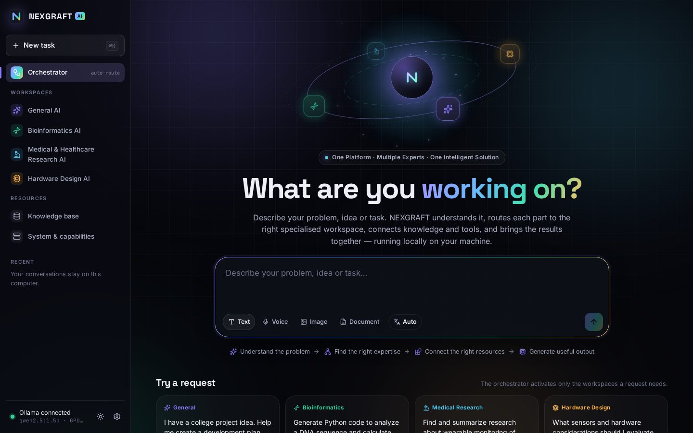
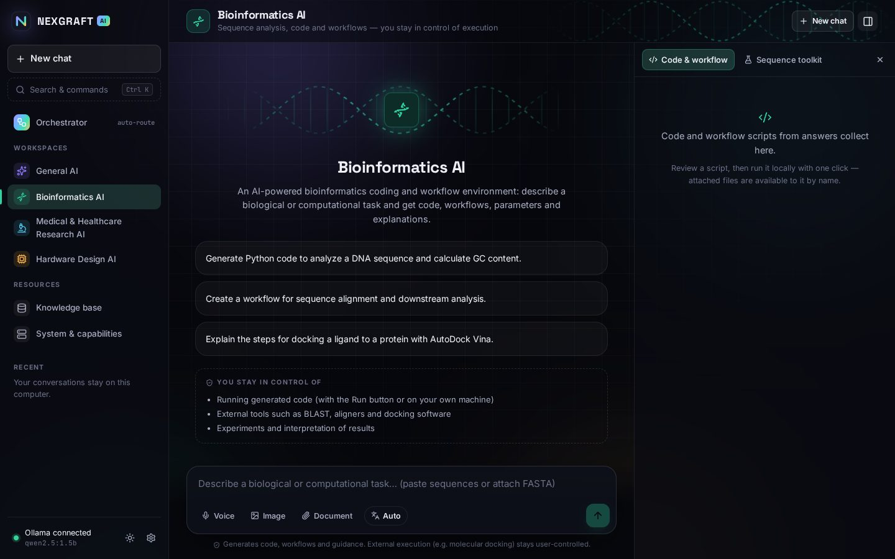
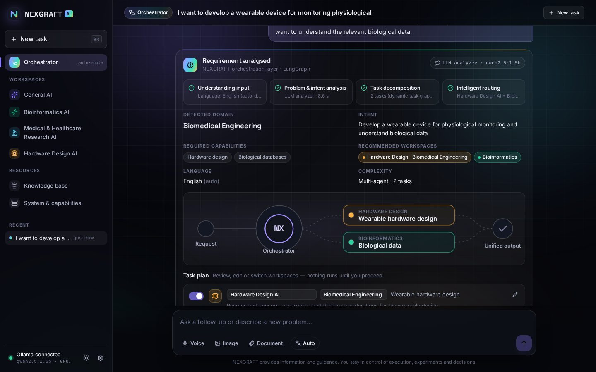
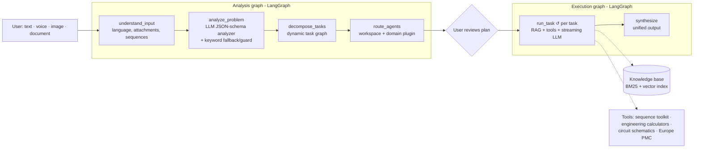

# NEXGRAFT AI

**One Platform. Multiple Experts. One Intelligent Solution.**

NEXGRAFT is a unified, multi-domain AI workspace. You describe a problem once; an orchestration layer understands it, works out which kinds of expertise it needs, splits complex problems into a task graph, and routes each task to a specialised workspace. The workspaces answer using local knowledge and deterministic tools, and NEXGRAFT combines the results into one output.

> Understand the problem → Find the right expertise → Connect the right resources → Generate useful output

This repository is the **local prototype**. It runs entirely on a normal laptop (built and tuned for a GTX 1650 Ti with 4 GB of VRAM and 16 GB of RAM) using open Qwen models served by [Ollama](https://ollama.com).



**Design:** an interactive WebGL 3D hero (hover and click the workspace satellites), a command palette (Ctrl/⌘ + K), animated workspace motifs, and a matching [Figma design system](https://www.figma.com/design/lmdUNL99MpkJhzGsA1jBNl) with tokens, components and screens. See [docs/DESIGN_SYSTEM.md](docs/DESIGN_SYSTEM.md).

## The four workspaces

| Workspace | What it does | You stay in control of |
|---|---|---|
| **General AI** | Explanations, reasoning, planning, writing, brainstorming, coding, summaries | How the output is used |
| **Bioinformatics AI** | A coding and workflow environment: Python/Biopython scripts, NGS and alignment workflows, docking workflow guidance. Includes a sequence toolkit and a **Run locally** button | Running code, external tools (BLAST, aligners, AutoDock Vina…), experiments |
| **Medical & Healthcare Research AI** | Research-grade literature exploration via Europe PMC (PubMed/MEDLINE), with numbered citations and evidence synthesis. **Not** diagnosis or telemedicine | Clinical interpretation and any healthcare decisions |
| **Hardware Design AI** | Engineering guidance through **domain plugins**: Biomedical, Electronics, Mechanical, Civil and Electrical, plus 17 engineering calculators; 8 of them draw **circuit schematics** | Design, simulation, fabrication, testing and validation |



The **Orchestrator** (home page) routes each request automatically, so "Explain Newton's laws" activates only General AI, while *"Design a wearable biomedical device and explain the medical research supporting the selected measurements"* becomes a two-task graph (Medical Research + Hardware Design / Biomedical) with a unified synthesis.



## Quick start (Windows)

**1. Install Ollama and pull models.** Install from [ollama.com/download](https://ollama.com/download), then in a terminal:

```powershell
ollama pull qwen2.5:3b          # main chat model — fits fully in 4 GB VRAM
ollama pull nomic-embed-text    # optional: semantic knowledge retrieval (274 MB)
ollama pull qwen2.5vl:3b        # optional: image understanding (loaded on demand)
```

Any Qwen model you already downloaded works. NEXGRAFT auto-selects the first installed Qwen chat model, and you can switch models in **Settings**.

**2. Install Python 3.10+ and Node.js 20.19+ (or 22+).** Node is needed once, to build the interface.

**3. Run it.** Double-click **`start.bat`** (or run it from a terminal). The first run creates a virtual environment, installs dependencies and builds the interface; later runs start in seconds. Your browser opens at **http://localhost:8000**.

On Linux or macOS, use `./start.sh`. To do it by hand:

```powershell
python -m venv .venv
.venv\Scripts\Activate.ps1          # Linux/macOS: source .venv/bin/activate
pip install -r backend/requirements.txt
cd frontend; npm install; npm run build; cd ..
python run.py
```

### Model guide for a 4 GB GPU (GTX 1650 Ti)

| Model | Size | Notes |
|---|---|---|
| `qwen2.5:3b` | ~1.9 GB | **Recommended.** Fully on GPU, fast, good routing |
| `qwen3:4b` | ~2.5 GB | Smarter; set context to 4096 in Settings. Thinking mode is turned off automatically for speed |
| `qwen2.5:7b` | ~4.7 GB | Works, but part of it runs on the CPU, so it is slower |
| `qwen2.5-coder:3b` | ~1.9 GB | Optional model for the Bioinformatics workspace (Settings → per-workspace models) |
| `nomic-embed-text` | 274 MB | Enables hybrid (semantic + keyword) retrieval |
| `qwen2.5vl:3b` / `moondream` | 3.2 / 1.7 GB | Enables image input; swapped in only when you attach an image |
| `nexgraft-bioinformatics` / `nexgraft-hardware` | ~2.2 GB each | Optional fine-tunes you build on your own GPU (below); used automatically by their workspace |

The **System & capabilities** page shows which models are loaded and how much of each one runs on the GPU.

### Fine-tuned workspace models (optional)

`finetune.bat` (or `./finetune.sh`) lightly fine-tunes Qwen2.5-3B on your own NVIDIA GPU, 4 GB is enough, for two workspaces: Bioinformatics AI (bioinformatics and biology Stack Exchange answers) and Hardware Design AI (electronics and engineering Stack Exchange answers). It uses QLoRA, merges the LoRA weights into the Qwen base, installs `nexgraft-bioinformatics` and `nexgraft-hardware` in Ollama, and writes a before/after evaluation report. The two workspaces then use these models automatically. Details: [docs/FINETUNING.md](docs/FINETUNING.md).

## How it works



- **Analysis:** a single structured-output call to the local model (constrained by a JSON schema) produces the domain, intent, capabilities and task plan. A deterministic keyword router is the fallback if the model is slow or fails, and a guard catches obvious small-model misroutes. Every decision is shown in the UI, including which router made it.
- **User control:** the plan appears as an editable card. You can toggle, retarget or add workspaces before anything runs, or turn on *Run plans automatically* in Settings.
- **Execution:** tasks run **sequentially** on purpose. On a 4 GB GPU, Ollama serves one request at a time, so parallel agents would only fight over VRAM. Tokens stream live to the UI.
- **Grounding:** each workspace retrieves from its knowledge collections and runs relevant tools **before** generating. Tool outputs are computed values (e.g. the exact GC content of a pasted sequence) that the model is told to use verbatim; literature abstracts become numbered citations.
- **Circuit schematics:** when a Hardware Design request is about a common circuit (LED + resistor, voltage divider, push-button, NPN transistor/relay switch, RC filter, inverting or non-inverting op-amp, LDO regulator), the model only picks the circuit and copies your values. A calculator computes standard E-series parts and draws the schematic with [schemdraw](https://schemdraw.readthedocs.io), so the wiring is always correct; the model then explains it part by part. The schematic appears in the answer with a parts list and SVG/PNG download, and any value you did not give is labelled as a default or a model choice. It costs one short extra model call and can be turned off in Settings.

More detail: [docs/ARCHITECTURE.md](docs/ARCHITECTURE.md).

## Implemented vs roadmap

Everything below is in the code and demonstrable today:

- ✅ Unified web workspace: Orchestrator + four specialised workspaces
- ✅ LangGraph orchestration: analysis graph and execution graph, with the live structure shown on the System page
- ✅ Intelligent routing, task decomposition, dynamic task graph and multi-agent synthesis
- ✅ Local LLMs via Ollama (Qwen), with optional per-workspace models
- ✅ Optional local fine-tuning for Bioinformatics and Hardware Design: QLoRA on a 4 GB GPU, merged into the Qwen weights, exported to Ollama, and evaluated against the untouched base
- ✅ Knowledge layer: hybrid RAG (BM25 + local NumPy vector index with Ollama embeddings) over extensible domain collections
- ✅ Bioinformatics tools (sequence stats, translation, ORFs, Biopython alignment) and a user-triggered local code runner that displays plots
- ✅ Medical literature search (Europe PMC) with citations; research-only boundary
- ✅ Hardware domain plugins (5) with 17 deterministic calculators
- ✅ Circuit schematics for 8 common circuits, drawn automatically for circuit requests or from the Calculators panel, with parts list and SVG/PNG download
- ✅ Input: text, voice (browser speech recognition in Chrome/Edge), documents (PDF, DOCX, TXT/MD, CSV, FASTA…), images (with a local vision model)
- ✅ English + 10 Indian languages (script detection, language-matched answers, read-aloud)

Not implemented yet (roadmap): offline speech recognition (e.g. Whisper), parallel agents on bigger GPUs, more workspaces and plugins, deeper tool integrations (BLAST/UniProt/PDB APIs), agentic tool-calling loops, a dedicated vector database, accounts and collaboration. **There is no proprietary NEXGRAFT foundation model**: the prototype uses open Qwen models through Ollama, optionally with the local fine-tunes above.

## What leaves your computer

NEXGRAFT runs locally. Only three things use the internet:

- **Europe PMC literature search** (Medical Research AI). It can be turned off in Settings.
- **Voice input**, which uses the browser's speech recognition. Chrome sends the audio to Google's speech service.
- **A remote Spline scene**, if you configure one.

Conversations are stored in your browser's local storage; uploads and the vector index live in `data/`.

**Code runner:** *Run locally* executes a generated Python script as a separate process in a temporary folder with a timeout, **with your user permissions**. It is not a security sandbox. It only runs when you press Run and confirm. Disable it with `NEXGRAFT_CODE_RUNNER=false`. The server only accepts requests from `localhost` and rejects cross-site requests.

## Project structure

```
backend/nexgraft/
  main.py                 FastAPI app, NDJSON streaming, uploads, runner, knowledge API
  orchestrator/           LangGraph graphs, LLM analyzer, keyword router, prompt/context budgeting
  agents/                 One module per workspace (auto-discovered) + shared grounding
  plugins/hardware/       One module per engineering domain plugin (auto-discovered)
  tools/                  Sequence toolkit, engineering calculators, schematic drawings, Europe PMC client
  knowledge/store.py      Hybrid BM25 + vector retrieval, on-disk index
  multimodal/             Document extraction, language detection, vision
  llm/ollama.py           Ollama client (streaming, JSON schema, embeddings, model selection)
backend/tests/            pytest suite (no model needed)
knowledge/<collection>/   Seed knowledge documents per domain; add your own
frontend/src/             React + TypeScript interface (views, components, design tokens)
finetune/                 Local fine-tuning pipeline: prepare, train (QLoRA), merge, GGUF export, evaluate
docs/                     Architecture, design system, fine-tuning, Spline guide, demo script
```

## Extending NEXGRAFT

- **New engineering domain:** copy `backend/nexgraft/plugins/hardware/civil.py`, change the id, keywords, prompt and tools, and add `knowledge/hardware-<id>/`. It appears automatically in routing and the Hardware workspace.
- **New workspace:** add a module in `backend/nexgraft/agents/` exposing `AGENT = AgentSpec(...)` (system prompt, keywords, knowledge collections, tools, optional `prepare` hook). The analyzer's prompt, the router, the sidebar and the System page pick it up automatically.
- **New tool:** add a `ToolSpec` to a module in `backend/nexgraft/tools/`. The UI generates the form from its parameter schema.
- **More knowledge:** use **Knowledge base → Add document**, or drop files into `knowledge/<collection>/` and press *Re-index*.

## Development

```bash
python run.py --reload            # backend on :8000 with auto-reload
cd frontend && npm run dev        # Vite dev server on :5173 (proxies /api to :8000)
cd backend && python -m pytest    # backend tests (install requirements-dev.txt)
python -m pytest finetune/tests    # fine-tuning data pipeline tests
cd frontend && npm run typecheck
```

## Troubleshooting

- **"Ollama offline"**: open the Ollama app (tray icon) or run `ollama serve`. If `OLLAMA_HOST` is set to `0.0.0.0`, NEXGRAFT still connects through `127.0.0.1`.
- **Slow answers**: check the System page. If the model is below 100% on the GPU, pick a smaller model or lower the context size in Settings. Close other GPU-heavy apps. Setting *Settings → 3D hero* to *Lite* or *Off* frees the GPU completely.
- **Routing feels wrong**: edit the plan before proceeding, or set the router to keyword-only. Larger models route better.
- **Indian-language quality**: small models are weaker in Tamil/Telugu/etc. Larger Qwen models improve it noticeably.
- **Image upload says "no vision model"**: `ollama pull qwen2.5vl:3b` (or `moondream`), then retry.

See also: [docs/FINETUNING.md](docs/FINETUNING.md) (fine-tuned workspace models) · [docs/DESIGN_SYSTEM.md](docs/DESIGN_SYSTEM.md) (tokens, Figma file, UI pieces) · [docs/SPLINE.md](docs/SPLINE.md) (custom 3D scene) · [docs/DEMO_SCRIPT.md](docs/DEMO_SCRIPT.md) (incubation demo walkthrough).
