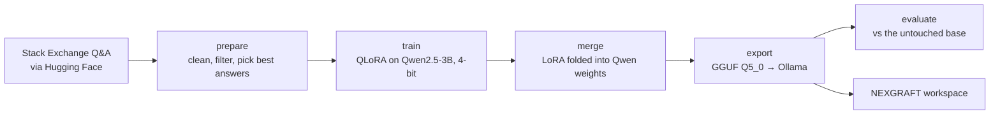

# Fine-tuning the workspace models

NEXGRAFT can lightly fine-tune Qwen for two workspaces on your own laptop. The LoRA changes are then merged into the Qwen weights:

| Workspace | Ollama model | Learns from |
|---|---|---|
| Bioinformatics AI | `nexgraft-bioinformatics` | bioinformatics.stackexchange.com, plus biology.stackexchange.com questions tagged genetics, molecular biology, genomics, proteins, phylogenetics and similar |
| Hardware Design AI | `nexgraft-hardware` | electronics.stackexchange.com and engineering.stackexchange.com |

Once installed, each workspace uses its model automatically. Everything else (the orchestrator, General AI, Medical Research AI and the synthesis) keeps using your default model.



## Requirements

- An **NVIDIA GPU with 4 GB or more** (built and sized for a GTX 1650 Ti) and a current driver. `nvidia-smi` must work.
- **16 GB RAM.** Merging the 3B model runs on the CPU and needs about 7 GB free.
- **About 30 GB of free disk** for both workspaces: PyTorch (~5 GB), the Qwen2.5-3B download (6 GB), a merged model per workspace (6 GB each) and the Ollama copies (~2.2 GB each).
- Python 3.10–3.12, and Ollama running with `qwen2.5:3b` installed (the chat template is copied from it).
- Internet access for the first run. Nothing leaves your computer except these downloads.

## Run it

Close NEXGRAFT and other GPU-heavy apps, then from the project folder:

```powershell
finetune.bat --quick     # trial run: 300 conversations per workspace, checks that everything works
finetune.bat             # full run: 1,500 conversations per workspace
```

On Linux or WSL, use `./finetune.sh`. The first run creates a separate environment in `.venv-finetune` and installs PyTorch with CUDA, so the app's own environment stays small.

Estimated time on a GTX 1650 Ti is about 1–1.5 hours of training per workspace, plus roughly 20 minutes for merging, conversion and evaluation. The script prints a live ETA after the first steps. You can stop with Ctrl+C at any time. Running it again skips the steps that already finished; training restarts from the beginning of the training step.

When it finishes, restart NEXGRAFT. **Settings → Per-workspace models** shows *Fine-tuned (nexgraft-…)* for these workspaces, and the System page tags the models.

## What happens in each step

**prepare**: downloads the Stack Exchange 2025 dump from Hugging Face ([HuggingFaceTB/stackexchange_2025_md](https://huggingface.co/datasets/HuggingFaceTB/stackexchange_2025_md), about 0.8 GB for these sites). It keeps open, positively scored questions without images, picks the best-scored or accepted answer, and drops answers that:

- only make sense inside the thread ("see the other answer", @-mentions)
- contain images, Python 2 code or the removed `Bio.SeqUtils.GC`
- are longer than 1,024 tokens

Links are reduced to their text so the model doesn't learn to invent URLs. The output is in `finetune/work/<workspace>/data/`, together with a `DATA_CARD.md` that lists sources, counts and licences.

**train**: QLoRA, tuned for a 4 GB card:

| Setting | Value | Why |
|---|---|---|
| Base model | `Qwen/Qwen2.5-3B-Instruct` | Same model as the default `qwen2.5:3b` |
| Base precision | 4-bit NF4 (~2.1 GB) | Fits next to the training state |
| LoRA | r=16, alpha=32, dropout 0.05, all attention and MLP projections (~30M parameters) | A light touch |
| Optimiser | 8-bit AdamW, lr 1e-4 with warm-up and cosine decay, 1 epoch | "Slightly" fine-tuned: about 94 steps of 16 conversations |
| Memory savers | Gradient checkpointing; loss computed in vocabulary chunks | The full logits for Qwen's 152k-token vocabulary would need about 1.2 GB |
| Loss | Assistant answer only | The model learns to answer, not to write questions |

The training system prompt is only the first sentence of the workspace prompt, for example *"You are NEXGRAFT Hardware Design AI, an engineering design assistant."* Stack Exchange answers do not follow the workspace formatting rules (sections, tables). Training them under those rules would teach the model to ignore the rules, which the app relies on.

**merge**: loads the base in bf16 on the CPU and folds the LoRA weights in. The result, in `finetune/work/<workspace>/merged/`, is a normal Hugging Face model, usable with Transformers, vLLM or any other tool.

**export**: converts the merged model to GGUF and runs `ollama create`. Weights are Q5_0 and the embeddings Q8_0, about 2.2 GB for the 3B model. That fits a 4 GB GPU with room for an 8k context, at quality comparable to the Q4_K_M `qwen2.5:3b`. `--quantize q8_0` (about 3.3 GB) is closer to full precision but no longer fits completely on a 4 GB GPU.

Ollama 0.34 imports safetensors only through its MLX engine, which does not run Qwen2 on Windows with CUDA, and it no longer quantises GGUF files at import. `finetune/gguf_convert.py` therefore writes the GGUF file itself with llama.cpp's `gguf` package, in the same format as Ollama's own Qwen models. The converter was checked against Transformers: tokenisation is identical, and greedy output matches token for token apart from small fp16 rounding differences.

**evaluate**: builds a temporary reference model from the *untouched* base, with the same conversion and quantisation, so differences come from the fine-tuning and not from quantisation. It writes `finetune/work/<workspace>/eval_report.md` with:

- MMLU accuracy on the workspace's subjects: college biology, high-school biology and medical genetics for Bioinformatics; electrical engineering, college physics and conceptual physics for Hardware
- a general-knowledge control subject (sociology) that shows whether anything was forgotten
- the held-out loss on expert answers the model never saw
- side-by-side answers to example prompts

`--vs qwen2.5:3b` compares with any other installed model instead.

## What to expect

A light fine-tune of a 3B model mostly shifts **tone, vocabulary and domain focus** toward how practitioners answer: more concrete tool and parameter advice for bioinformatics, and more practical electronics and mechanics reasoning. The held-out loss should drop clearly. MMLU scores usually move by a few points at most, because a 3B model's factual knowledge barely changes from 1,500 examples. Facts still come from the knowledge base, the tools and the literature search. Read the side-by-side answers in the report and decide whether you prefer the fine-tuned model. You can switch back at any time.

## Options

Run individual steps with `python -m finetune.<step>` from `.venv-finetune`, or pass options through the launcher (`finetune.bat --workspace hardware --lr 5e-5`). The most useful options:

| Option | Default | Notes |
|---|---|---|
| `--workspace` | both | `bioinformatics`, `hardware` |
| `--steps` | all | e.g. `--steps evaluate` |
| `--quick` | off | 300 conversations and a shorter evaluation |
| `--examples` | 1500 | Training conversations per workspace |
| `--base` | `Qwen/Qwen2.5-3B-Instruct` | `Qwen/Qwen2.5-1.5B-Instruct` for less memory, faster runs and an Apache-2.0 licence |
| `--lr`, `--epochs`, `--lora-r` | 1e-4, 1, 16 | Higher values are a stronger, riskier change |
| `--max-len` | 1024 | Lower it (e.g. 768) if you run out of GPU memory |
| `--quantize` | `q5_0` | `q8_0`, `f16` |
| `--keep-gguf` | off | Keep the `.gguf` file for LM Studio or llama.cpp |
| `--force` | off | Redo finished steps |

## Using, switching off and removing

- **Per workspace:** Settings → Per-workspace models → pick any other model (for example `qwen2.5:3b`) to override the fine-tuned one.
- **Everywhere:** set `NEXGRAFT_FINETUNED=false` in `.env`.
- **Remove:** `ollama rm nexgraft-bioinformatics nexgraft-hardware`, and delete `finetune/work/` and `.venv-finetune/` to free the disk space. The merged models in `finetune/work/*/merged/` are the largest part (6 GB each) and can be deleted once the Ollama models exist.

On a 4 GB GPU, moving between a fine-tuned workspace and the rest of the app swaps models, which costs a few seconds of loading.

## Troubleshooting

- **Out of GPU memory:** close other GPU apps, including browsers with hardware acceleration and games, and retry. The script unloads Ollama's models before training. If it still fails, use `--max-len 768`, or `--base Qwen/Qwen2.5-1.5B-Instruct`.
- **"PyTorch cannot see your NVIDIA GPU":** update the NVIDIA driver from nvidia.com, restart Windows and run the launcher again.
- **Loss becomes `nan`:** retry with `--lr 5e-5`. The GTX 1650 Ti trains in fp16, which is less forgiving than the bf16 of newer cards.
- **"Ollama is not running":** open the Ollama app, then run `finetune.bat --steps export evaluate`.
- **Slow downloads:** set a free Hugging Face token (`set HF_TOKEN=hf_...`) for higher download limits.

## Licences

- **Qwen2.5-3B-Instruct** is under the Qwen Research License, which does not allow commercial use without permission from Alibaba Cloud. Qwen2.5-1.5B-Instruct and Qwen2.5-7B-Instruct are Apache-2.0.
- **Training data:** Stack Exchange content is licensed CC BY-SA 3.0/4.0 by its authors. Each training example links to its source question, and `DATA_CARD.md` lists the sources. Keep that attribution if you share the data or the models.
- **Evaluation:** MMLU (`cais/mmlu`, MIT) is used only for evaluation, never for training.
